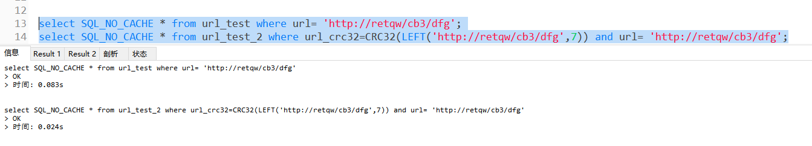

1.如果数据库表有个URL字段，用来存储路径，有什么好的办法提高查询效率?
答：利用hash索引，前缀索引的思想，优化url字段匹配查询。
- 通过计算字符区分度，算出截取url多少字符，能接近URL全值匹配的效果。
- 然后将截取的前缀字符，通过CRC32函数转换为数值。新建一个列用来存储这个hash值，用来代替URL字段的匹配查询
- hash值会有冲突，也就是会重复。要达到精准匹配，where条件还需要加上url字段的匹配条件
注意：hash列是为了快速过滤不匹配的记录，缩小记录的范围。然后通过URL的匹配查询达到精准查询。

例子：
- [参考表结构](url_test.sql)
- 
- 通过计算，得出截取前12个字符，跟全值区分度差不多。将url截取12个字符，然后转为hash数值,存储到url_crc32字段上。
- update url_test_2 set url_crc32=CRC32(LEFT(url,7));
- 